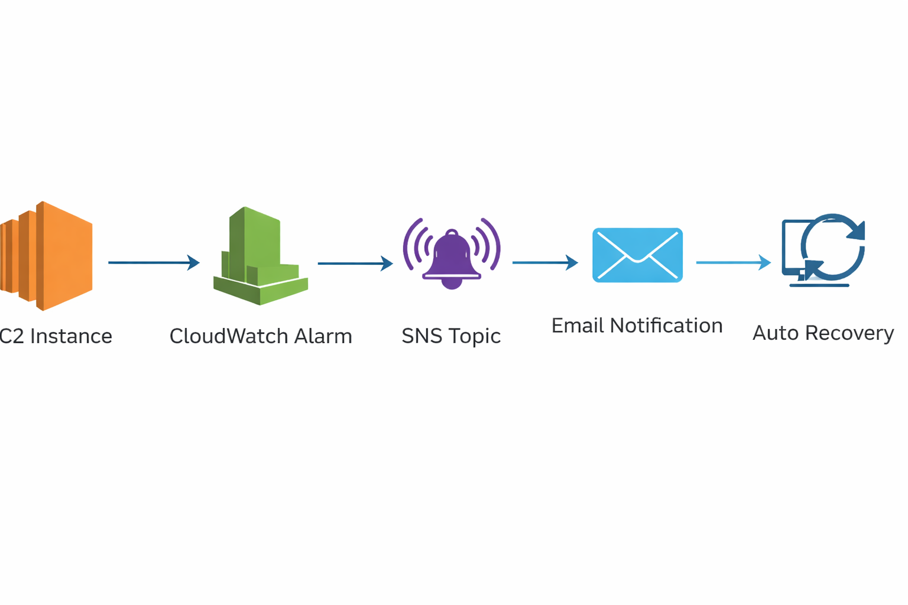
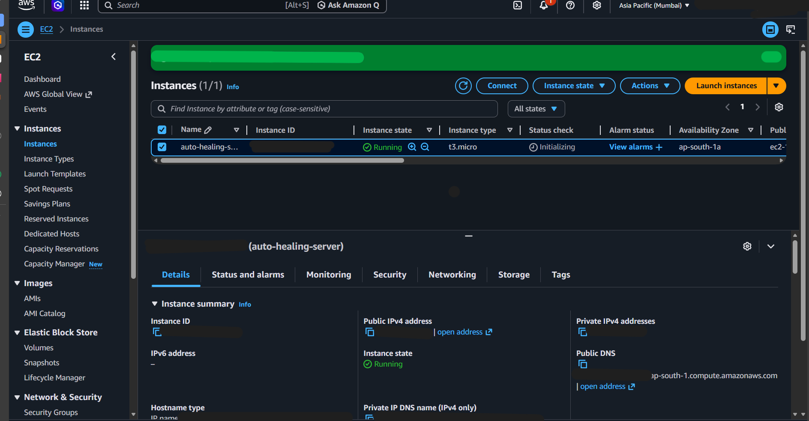
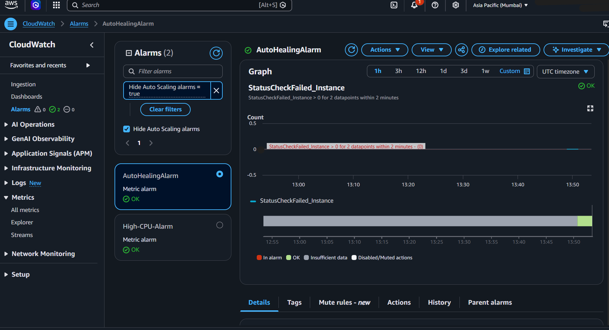
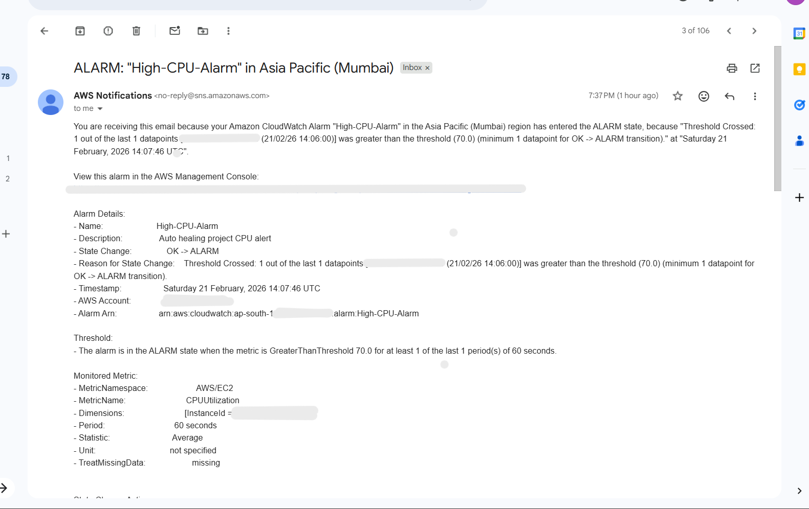
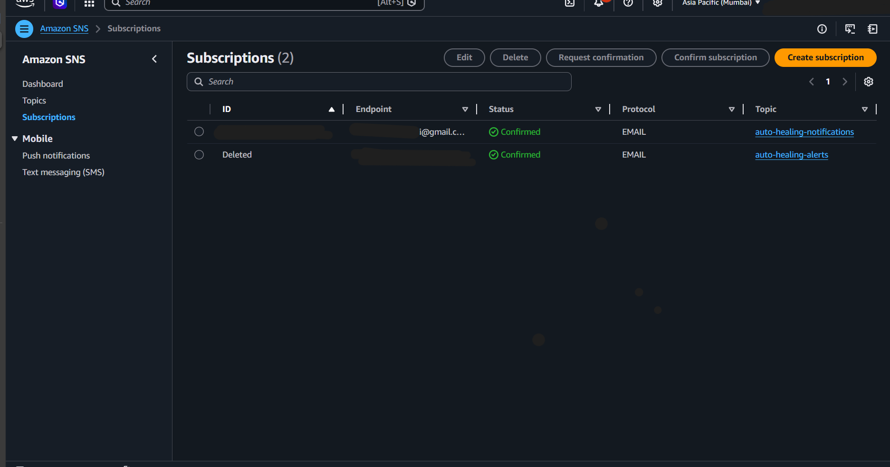
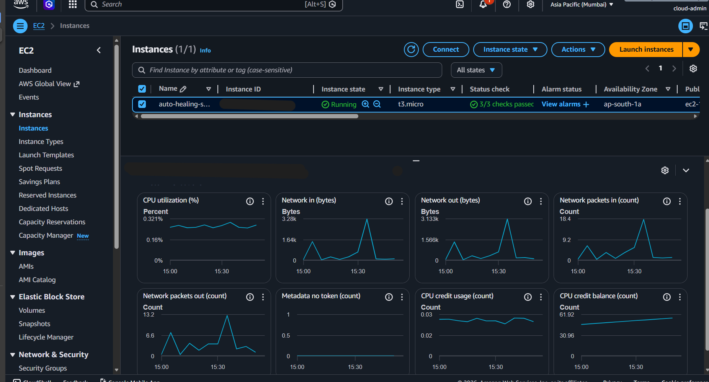
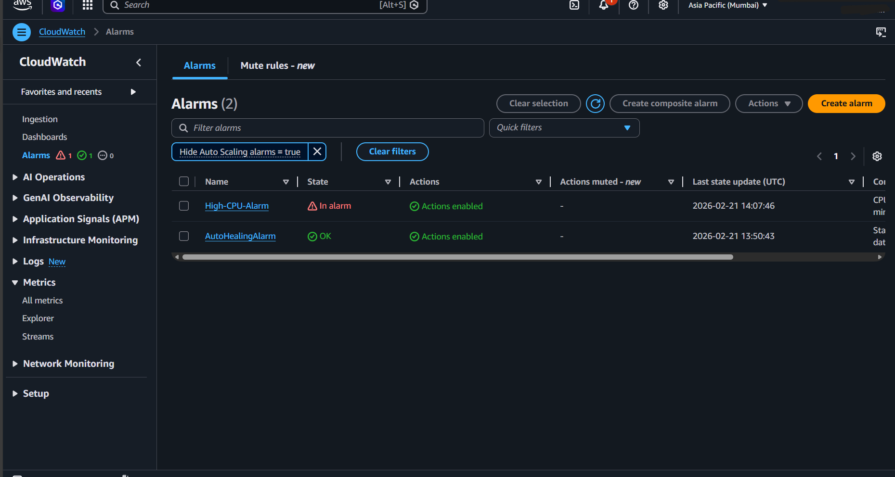

# AWS Auto-Healing Infrastructure — DevOps Monitoring & Automated Self-Recovery System

## Project Overview

This project demonstrates a **production-grade DevOps implementation** of automated monitoring and self-healing cloud infrastructure using AWS services.

The system continuously monitors the health of an EC2 instance and automatically triggers recovery actions when failures are detected. Real-time alerts are also sent to administrators, ensuring high availability, reliability, and operational resilience of cloud resources.

This project simulates how modern DevOps teams maintain highly available infrastructure in real-world production environments.

---

## Architecture

---

## AWS Services Used

* **Amazon EC2** — Virtual server hosting application
* **Amazon CloudWatch** — Monitoring metrics and alarms
* **Amazon SNS** — Email notifications and alerts
* **AWS Lambda** — Automation logic for notifications
* **IAM** — Secure role-based permissions

---

## Features

✅ Real-time infrastructure monitoring  
✅ Automated failure detection  
✅ Self-healing (automatic instance reboot on failure)  
✅ Email alert notifications  
✅ Server health validation  
✅ Production-style DevOps workflow  

---

## How It Works

1. EC2 instance runs a web server.
2. CloudWatch continuously monitors instance health metrics.
3. If a failure or abnormal condition occurs:

   - Alarm is triggered.
   - EC2 auto-recovery action is executed.
   - Email notification is sent via SNS.
4. The instance automatically returns to a healthy state.

---

## Project Screenshots

### EC2 Instance Running

### Alarm Configuration

### Email Notification

### SNS Subscription

### CPU Spike

### Alarm Triggered

---

## Failure Simulation

Failures were simulated by:

* Creating high CPU load
* Rebooting the instance
* Triggering CloudWatch alarms

The system successfully detected failures and performed automated recovery actions.

---

## Key DevOps Concepts Demonstrated

* Infrastructure Monitoring & Observability
* Incident Detection & Response
* Automated Recovery (Self-Healing Systems)
* Cloud Automation
* Reliability Engineering (SRE Principles)
* Alerting & Notifications
* Production Operations Workflow

---

## Learning Outcomes

* Hands-on experience with AWS cloud infrastructure
* Understanding monitoring and observability systems
* Implementation of self-healing architecture
* Practical DevOps automation knowledge
* Real-world incident response workflow

---

## Future Improvements

* Infrastructure as Code using Terraform or CloudFormation
* Auto Scaling Group integration
* CI/CD pipeline automation
* Containerization using Docker
* Centralized logging with CloudWatch Logs

---

## Author

**Rohini Navalagund**  
Cloud & DevOps Enthusiast

---

## License

This project is for educational and demonstration purposes.
